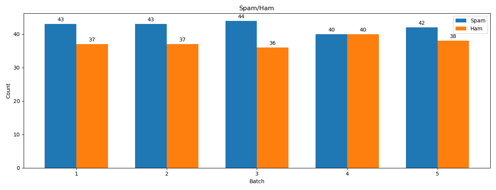

# Spam_Email_Classification_with_Spark_Streaming
Project carried out as a part of Big Data Course at PES University.     
A Distributed Real Time Spam Email Classification built using Apache Spark.    
Classification Models like Naive Bayes(NB),Support Vector Machine(SVM), Logistic Regression(LR), Multi Layer Perceptron(MLP), Passive Aggressive Classifier(PA) and KMeans, CustomKMeans clustering models are trained on the dataset using preprocessing Methods like TF-IDF and Word2Vec Embedding Model, then the performance of each is compared below.

## About Enron Spam Email Dataset
Dataset Source: https://www.kaggle.com/wanderfj/enron-spam    
Details:
- Each record consists of 3 features - the subject, the email content and the label
- Each email is one of 2 classes, spam or ham
- 30k examples in train and 3k in test

## Commands for execution

Command to execute streamer(which streams training dataset):
```console
python3 stream.py -f <dataset> -b <batch_size>
Example: python3 stream.py -f spam -b 80
```

Command to execute testStreamer(which streams testing dataset):
```console
python3 testStream.py -f <dataset> -b <batch_size>
Example: python3 stream.py -f spam -b 80
```

Command to execute client code(i.e., main.py):
```console
/opt/spark/bin/spark-submit main.py -host <hostname> -p <port_no> -w <window_size> -op <operation> -proc <preprocessing_method> -sf <sampling_fraction> -m <model_name> -hash <hashmap_size> -e <explore> -c <is_clustering> -endless <is_endless> 2>log
Example: /opt/spark/bin/spark-submit main.py -host localhost -p 6100 -w 5 -op train -proc hf -m NB -hash 14 2> log
```
Flags and their meaning:    
* host = Hostname(default=localhost)    
* p = Port number(default=6100)    
* w = Window Interval(in seconds)(default=5s)     
* op = Operation being performed, choose one among test, train.(default=train)    
* proc = Preprocessing method to be employed, choose one among tf, word2vec, glove, use, elmo or bert(default=tf)    
* sf = Sampling Fraction for every batch(of type float in the range (0,1]) (default=1.0). Note: Using fraction less than 1.0 might affect accuracy of the models so use it only when the batch size is huge and cannot be stored in memory.     
* c = Takes bool value. True if clustering is to be applied, False otherwise.(default=False)  
* endless = Takes bool value. True if endless streaming is enabled. False otherwise. (default=False)
* e = Takes bool value. True if data exploration is to be applied, False otherwise.(default=False) 
* m = Model to be used, choose one among NB, SVM, LR, MLP, PA, KMeans, Birch (i.e., Naive Bayes,Support Vector Machine, Logistic Regression, Multi Layer Perceptron, Passive Aggressive Classifier and KMeans, Birch, CustomKMeans clustering models respectively).(default=NB)   
* hash = Hashmap size(2^(this number)) to be used, default and recommended hash map size on a system of 4GB RAM is 14 and on 2GB RAM it is 10. But please note that decreasing the hash map size may impact the performance of model due to collisions.

## Command to plot Data Exploratory visualizations(stored in visualizations folder):
```console
python3 ./visualizations/visualizations.py
Example: python3 ./visualizations/visualizations.py
```

## Installing required Modules/Dependencies
```console
pip3 install sklearn
pip3 install numpy
pip3 install matplotlib
pip3 install joblibspark
pip3 install spark-nlp==3.3.4
```

## Preliminary Analysis

* Spam and Ham Emails distribution

* Number of Spam and Ham emails in each batch


## Data Exploration
A Spam and Ham Email Sample along with the average length, variance of ham and spam emails. 


## Hyper Parameter Tuning
Hyper Parameter Tuning is performed for all models for a batch size of 70 and TF-IDF preprocessing method
1. Logistic Regression  

2. Multi Layer Perceptron     

3. Passive Aggressive Classifier    

4. Support Vector Machines  


## Performance of the Models

1. Logistic Regression  

2. Multi Layer Perceptron   

3. Naive Bayes  

4. Passive Aggressive   

5. Support Vector Machines  


## Comparision of Models
Using TF-IDF preprocessing method   


## Comparision of preprocessing methods


## Performance of Models with varying streaming batch size


## Spam Classification as a Clustering Problem
1. Cluster Visualization assuming there are 2 clusters

2. Cluster Visualization assuming there are 3 clusters

3. Cluster Visualization assuming there are 4 clusters


## WCSS for each batch on an endless stream with Custom KMeans Clustering Model
